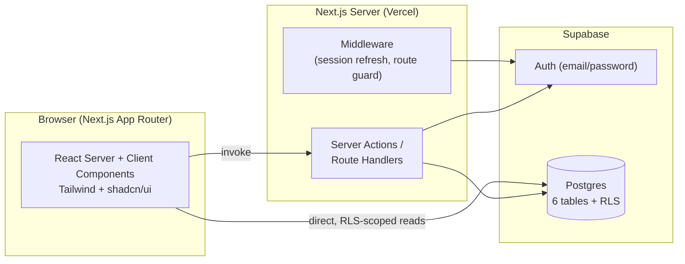
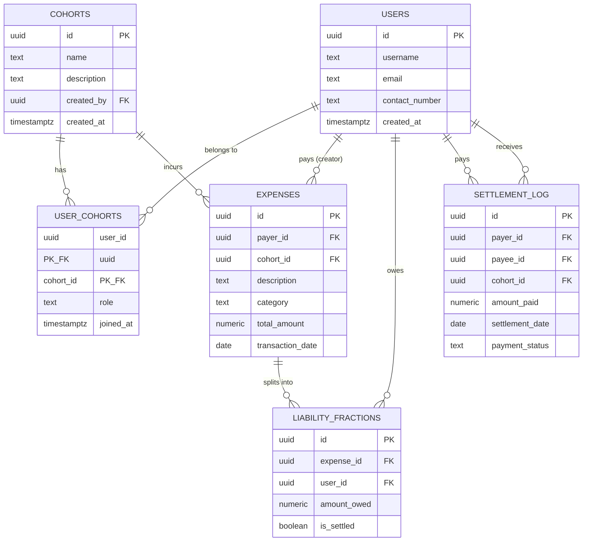

# Design Document
**Project:** SubSqueeze — Shared Expense & Subscription Settlement App
**Companion to:** `01_PID.md` · **Schema source:** `supabase_schema.sql`
**Document version:** 1.0
**Last updated:** 2026-06-22

---

## 1. Goals & Non-Goals

**Goals**
- Faithfully implement the academic LDM as a real, normalized Postgres schema.
- Make adding an expense and seeing "who owes whom" take under 15 seconds.
- Keep the codebase simple enough that a single AI coding agent pass produces a
  working app — no exotic patterns, no microservices, no custom backend.

**Non-goals** (see PID §4.2 for the full out-of-scope list)
- Real money movement / payment gateways
- Notifications, recurring billing automation
- Multi-tenant org/admin tooling beyond simple cohort roles

## 2. System Architecture



- **Next.js App Router**, deployed on Vercel. Server Components fetch data directly
  via the Supabase server client wherever possible (no custom REST API needed).
- **Server Actions** handle all writes (create expense, join cohort, record
  settlement) so business logic — split calculation, validation — lives server-side
  and is never trusted from the client.
- **Supabase** provides Postgres, Auth, and Row Level Security. RLS is the actual
  authorization layer — the app never manually checks "is this my data" in
  application code beyond what RLS already enforces.
- **Middleware** refreshes the Supabase session cookie on every request and
  redirects unauthenticated users away from protected routes.

## 3. Tech Stack (detailed)

| Concern | Choice | Notes |
|---|---|---|
| Framework | Next.js 15, App Router, TypeScript | `app/` directory, Server Components by default |
| Styling | Tailwind CSS v4 | Utility-first, no separate CSS files needed |
| UI components | shadcn/ui (New York style) | Installed as owned source, not an npm black box |
| Icons | lucide-react | Ships with shadcn by default |
| Backend/DB | Supabase (Postgres 15+) | Auth, RLS, instant REST/Realtime if needed later |
| Supabase client | `@supabase/ssr` | Cookie-based session handling for App Router |
| Forms | React Hook Form + Zod | Client-side UX validation; Zod schema reused server-side |
| Toas/feedback | `sonner` (via shadcn) | Lightweight toast notifications |
| Dates | `date-fns` | Formatting transaction/settlement dates |
| Hosting | Vercel | First-class Next.js support, generous free tier |
| Package manager | pnpm | Fast installs; npm is a fine fallback |

## 4. Data Model

This is the LDM from the academic report, translated into Postgres types and
Supabase conventions. Full DDL lives in `supabase_schema.sql` — this section is
the human-readable reference.



**Key normalization decisions carried over from the report:**
- `EXPENSE` stores the fact (amount, description, category, date) exactly once.
- `LIABILITY_FRACTION` stores each member's share as its own row
  (`expense_id`, `user_id`, `amount_owed`, `is_settled`) — no repeating
  `user1_owes`/`user2_owes` columns, no duplicated expense fields. This is what
  resolves Anomaly 1 (update anomaly) from the original report.
- `EXPENSE` and `LIABILITY_FRACTION` are independent tables linked only by FK,
  so settling/deleting a liability row never deletes the parent expense — this is
  what resolves Anomaly 2 (deletion anomaly / lost audit trail).
- `USER_COHORTS` resolves the USER<->COHORT many-to-many relationship.
- `SETTLEMENT_LOG` is **immutable** — the project proposal explicitly describes
  settlement records as immutable. A database trigger (`settlement_log_no_update`)
  prevents any UPDATE after creation; there is no RLS DELETE policy on this table.
  Corrections are made by adding a new, offsetting settlement entry, not by
  editing the original. This preserves the audit trail the proposal requires.

**Expense category:** `expenses.category` is a constrained enum — `subscription`
or `general`. This reflects the proposal's explicit distinction between recurring
digital subscriptions (Netflix, Spotify, Canva Pro) and one-off physical costs
(groceries, utilities). The UI surfaces this as a two-option selector when adding
an expense, and the activity feed and ledger can filter/group by it.

**Money type:** all amounts are `numeric(12,2)`, never `float`/`double` — required
to avoid the rounding drift that floating point introduces in financial splits.

**Balance calculation** (derived, not stored): for a given cohort and user pair,
net balance = `Σ unsettled liability_fractions owed *to* them` − `Σ unsettled
liability_fractions they owe` − `Σ settlements already exchanged between the
pair`. This is computed in a query/view, never persisted, so it's always
consistent with the ledger.

## 5. Folder Structure

```
subsqueeze/
├─ app/
│  ├─ (auth)/
│  │  ├─ login/page.tsx
│  │  └─ signup/page.tsx
│  ├─ (app)/
│  │  ├─ layout.tsx                 # authenticated shell, sidebar/nav
│  │  ├─ dashboard/page.tsx         # overall balances across cohorts
│  │  ├─ cohorts/
│  │  │  ├─ page.tsx                # list / create / join
│  │  │  └─ [cohortId]/
│  │  │     ├─ page.tsx             # cohort balances + members
│  │  │     ├─ expenses/
│  │  │     │  ├─ page.tsx          # expense ledger
│  │  │     │  └─ new/page.tsx      # add expense + split form
│  │  │     └─ settle/page.tsx      # record a settlement
│  │  └─ profile/page.tsx
│  ├─ layout.tsx                    # root layout, theme provider
│  └─ middleware.ts                 # session refresh + route guard
├─ components/
│  ├─ ui/                           # shadcn-generated primitives
│  ├─ expense-form.tsx
│  ├─ split-editor.tsx              # equal vs custom split UI
│  ├─ balance-card.tsx
│  ├─ cohort-switcher.tsx
│  └─ activity-feed.tsx
├─ lib/
│  ├─ supabase/
│  │  ├─ client.ts                  # browser client
│  │  ├─ server.ts                  # server component client
│  │  └─ middleware.ts              # session refresh helper
│  ├─ actions/
│  │  ├─ expenses.ts                # server actions: create/edit/delete expense
│  │  ├─ cohorts.ts                 # create/join/leave cohort
│  │  └─ settlements.ts             # record settlement
│  ├─ validations.ts                # Zod schemas, shared client+server
│  └─ balances.ts                   # net-balance calculation helpers
├─ supabase_schema.sql
└─ ...config files (tailwind, tsconfig, etc.)
```

## 6. Core Features & User Flows

### 6.1 Auth
- Email + password sign up/login via Supabase Auth.
- On sign-up, a `public.users` profile row is auto-created via a Postgres trigger
  on `auth.users` insert (see schema) — the app never manually inserts into
  `users` on sign-up.
- `middleware.ts` redirects unauthenticated visitors from any `(app)` route to
  `/login`.

### 6.2 Cohorts
- **Create:** name + optional description → creator becomes `role = 'admin'` in
  `user_cohorts`.
- **Join:** via a shareable invite code (simplest v1: the cohort's UUID, or a
  short generated code stored alongside it) → new row in `user_cohorts` with
  `role = 'member'`.
- **Cohort home:** shows member list, per-member net balance within that cohort,
  and quick actions ("Add expense", "Settle up").

### 6.3 Add Expense
1. User picks a cohort, enters description, selects **category** (subscription or
   general — a two-option control, not a free-text field), total amount, and date.
2. User selects which cohort members are included in the split (default: all).
3. User picks **Equal split** (amount divided by N, remainder cents assigned to the
   payer so shares always sum exactly to `total_amount`) or **Custom split**
   (manually enter each person's share; form blocks submission unless shares sum
   exactly to `total_amount`).
4. On submit, a Server Action creates one `EXPENSE` row and N `LIABILITY_FRACTION`
   rows in a single transaction.

### 6.4 Dashboard / Balances
- Top-level dashboard aggregates balances across all of the user's cohorts:
  "You are owed ₱X overall" / "You owe ₱Y overall."
- Per-cohort view breaks this down per member ("You owe Daniel ₱150").
- Computed via the helper in `lib/balances.ts`, backed by a Postgres view
  (see §8 below) so the math is consistent whether read from a Server Component
  or a Server Action.

### 6.5 Settle Up
- From a cohort or a specific member's balance card, "Settle up" opens a form
  pre-filled with the suggested amount (the current net balance).
- Submitting inserts a `SETTLEMENT_LOG` row. Settlement records are **immutable
  once written** — the database trigger prevents any UPDATE and there is no delete
  path in the UI or RLS. If a user entered the wrong amount, they record a
  correcting settlement in the opposite direction; they cannot edit the original.
- Net balance recalculates immediately. Marking a specific
  `LIABILITY_FRACTION.is_settled = true` is a secondary, optional action
  available from the expense ledger for users who want per-expense granularity.

### 6.6 Activity Feed
- Reverse-chronological feed per cohort combining `EXPENSE` and
  `SETTLEMENT_LOG` rows ("Daniel added 'Netflix — June' ₱149", "You paid Daniel
  ₱150").

## 7. Server Actions / Data-Access Surface

No separate REST API is built — Server Actions are the only "API":

| Action | Input | Effect |
|---|---|---|
| `createCohort` | name, description | insert `cohorts` + `user_cohorts` (admin) |
| `joinCohort` | invite code | insert `user_cohorts` (member) |
| `leaveCohort` | cohort id | delete own `user_cohorts` row |
| `createExpense` | cohort id, description, amount, date, split map | insert `expenses` + N `liability_fractions` (transactional) |
| `updateExpense` | expense id, fields | update `expenses`, recompute `liability_fractions` |
| `deleteExpense` | expense id | delete `expenses` (cascades `liability_fractions`) |
| `recordSettlement` | payee id, cohort id, amount | insert `settlement_log` |
| `markLiabilitySettled` | liability fraction id | update `is_settled = true` |

All inputs validated with a shared Zod schema (`lib/validations.ts`) before
hitting Supabase; Supabase RLS is the second, non-bypassable layer of defense.

## 8. Supabase Specifics

- **RLS is on for every table.** A user can only see cohorts they belong to, and
  only the expenses/liabilities/settlements tied to those cohorts or to
  themselves directly. Full policies are in `supabase_schema.sql`.
- **`is_cohort_member(cohort_id)`** — a `security definer` SQL function — is the
  single source of truth used across policies to avoid repeating the membership
  subquery (and to avoid recursive RLS issues on `user_cohorts` itself).
- **Optional balance view** (`v_cohort_balances`) recommended in the schema file
  for simplifying the dashboard query — netting liabilities against settlements
  in SQL rather than in application code.
- **Trigger** `on_auth_user_created` auto-populates `public.users` from
  `auth.users` so the app never has an authenticated user without a profile row.

## 9. Component Inventory (shadcn/ui)

`button`, `card`, `input`, `label`, `form`, `dialog`, `dropdown-menu`, `avatar`,
`badge`, `tabs`, `table`, `separator`, `select`, `toast`/`sonner`, `skeleton`
(loading states), `alert` (empty/error states).

## 10. Visual Design Language

These are binding constraints, not suggestions. AI coding agents tend to
converge on a handful of recognizable "AI-generated app" looks regardless of
what they're building — and a money app between roommates loses trust fast if
it reads as a generic template. Give Antigravity this whole section as
context, not just the rules.

### Explicitly ruled out
- **No emojis anywhere in the UI** — not in buttons, nav labels, empty
  states, toasts, or copy. Use `lucide-react` icons for any visual marker.
- **No glassmorphism** — no translucent/frosted panels, no `backdrop-blur`
  cards floating over gradients, no glowing borders.
- **No decorative gradients** used as a substitute for an actual color
  decision, scattered across cards/buttons/backgrounds.
- **No generic "AI SaaS template" defaults.** Specifically avoid: (a) a warm
  cream background (`#F4F1EA`-ish) paired with a high-contrast serif headline
  and a terracotta accent; (b) a near-black background with a single bright
  neon/acid accent color; (c) a hairline-rule, zero-border-radius "broadsheet"
  layout used as the entire identity. These show up by default regardless of
  subject — SubSqueeze has an actual subject (a household ledger) to design
  from instead.
- **No numbered "01 / 02 / 03" step markers** unless something is a literal
  sequence — cohorts and expenses aren't steps, don't decorate them as one.

### Design direction: a ledger, not a dashboard
The subject is money owed between people who live together. The job is
clarity and trust, not excitement. Lean into the *ledger/receipt* metaphor
that's actually true to the content — rows of transactions, aligned numbers,
clear debits and credits — instead of a generic fintech-dashboard-with-charts
look.

**Color tokens** — define once as CSS variables / Tailwind theme values, then
reuse everywhere. No component introduces a one-off color outside this set:

| Token | Value | Use |
|---|---|---|
| `--ink` | `#1B1F23` | primary text, headers |
| `--paper` | `#FAF9F6` | app background — a quiet off-white, not stark white, not the cream-serif cliché above |
| `--paper-raised` | `#FFFFFF` | card/surface background; pair with a 1px `--line` border instead of a drop shadow |
| `--owed-to-you` | `#2F6F4F` | muted forest green — "you are owed" amounts only |
| `--you-owe` | `#A8442F` | muted clay red — "you owe" amounts only |
| `--line` | `#E4E1D8` | hairline borders/dividers between ledger rows |
| `--muted` | `#6B6F76` | secondary text, timestamps, captions |

`--owed-to-you` and `--you-owe` are the *only* two semantic colors in the
app — reserve them for balance direction and don't reuse them for anything
else (badges, links, decoration), or the meaning dilutes.

**Typography:**
- Headers/display (cohort names, dashboard totals, page titles): a confident,
  slightly condensed grotesque — `Inter Tight` or `Archivo`.
- Body: a highly legible humanist sans — `Inter` or `IBM Plex Sans`.
- Every monetary amount uses tabular figures (`font-variant-numeric:
  tabular-nums`) so columns of numbers actually align — this matters more
  here than in almost any other type of app.

**Layout:**
- Ledger rows (expense list, settlement history, activity feed) are dense,
  tabular, left-aligned with right-aligned amounts — like a real statement
  line, not a card grid.
- Cards are reserved for summary/aggregate surfaces (balance totals, cohort
  switcher), not for every individual transaction row.
- Generous but not excessive whitespace — this is a utility app people check
  quickly, not a marketing page.

**Signature element:** the running-balance number — large, tabular,
color-coded green/clay, with a small label beneath it ("you're owed" / "you
owe"). This is the one place to spend visual weight; keep everything else
quiet and disciplined around it.

**Motion:** minimal and functional only — a brief fade/slide when a new
ledger row appears, a small confirmation micro-interaction on settling up.
No ambient background animation, no scroll-triggered reveals — extra motion
without a functional reason is itself a tell that a UI is AI-generated filler.

**Consistency rule:** once these tokens are set in the Tailwind config /
`globals.css`, every component pulls from them. No ad hoc border-radius,
shadow, or color value gets introduced per-component.

## 11. State Management

- Server state (cohorts, expenses, balances) is fetched server-side in Server
  Components — no client-side global store (Redux/Zustand) needed for v1.
- Local UI state (split editor row values, dialog open/closed) uses plain React
  `useState`.
- After a Server Action mutation, call `revalidatePath()`/`router.refresh()`
  rather than maintaining a separate client cache.

## 12. Security

- Route protection via `middleware.ts` (redirect unauthenticated users).
- RLS as the real authorization boundary (see §8) — never trust a client-passed
  `user_id`; always derive identity from `auth.uid()` server-side.
- Service-role key (if ever needed for an admin script) stays server-only,
  never exposed to the client bundle.

## 13. Non-Functional Requirements

- **Responsive:** mobile-first layout; primary flows (add expense, view balance,
  settle up) usable one-handed on a ~375px viewport.
- **Performance:** dashboard balance query should resolve in a single round trip
  per cohort (use the SQL view, not N+1 client-side aggregation).
- **Accessibility:** shadcn/Radix primitives provide keyboard/focus handling out
  of the box; don't override focus outlines.

## 14. Future Enhancements (v2 backlog — not built now)

- **Debt routing simplification** — this is one of the three core stated problems
  in the project proposal ("dependency hell": A owes B, B owes C, so A can pay C
  directly). The v1 schema captures the complete debt graph in
  `LIABILITY_FRACTION` rows; v2 adds a server-side computation over that graph to
  suggest the minimum set of transactions that clears the whole cohort. No schema
  changes are required to add this.
- Recurring/subscription auto-expense generation.
- Push/email reminders for outstanding balances.
- Payment gateway integration (GCash/Maya) to mark settlements as verified
  rather than self-reported.
